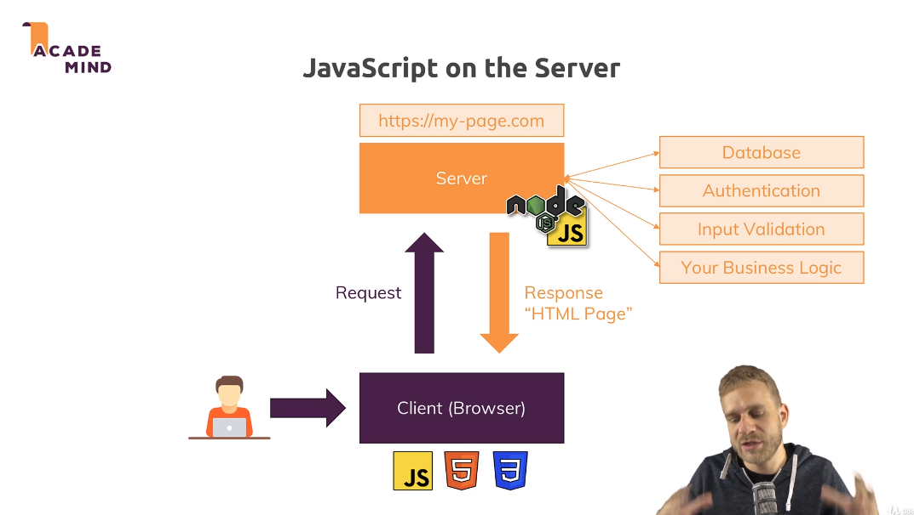
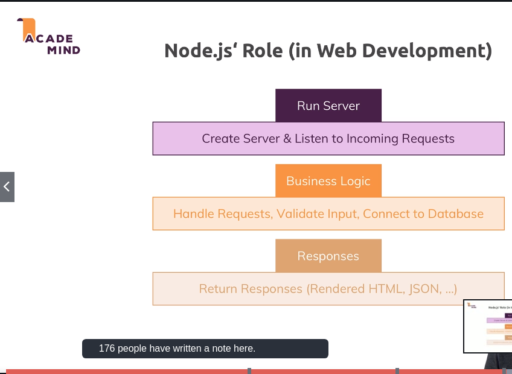
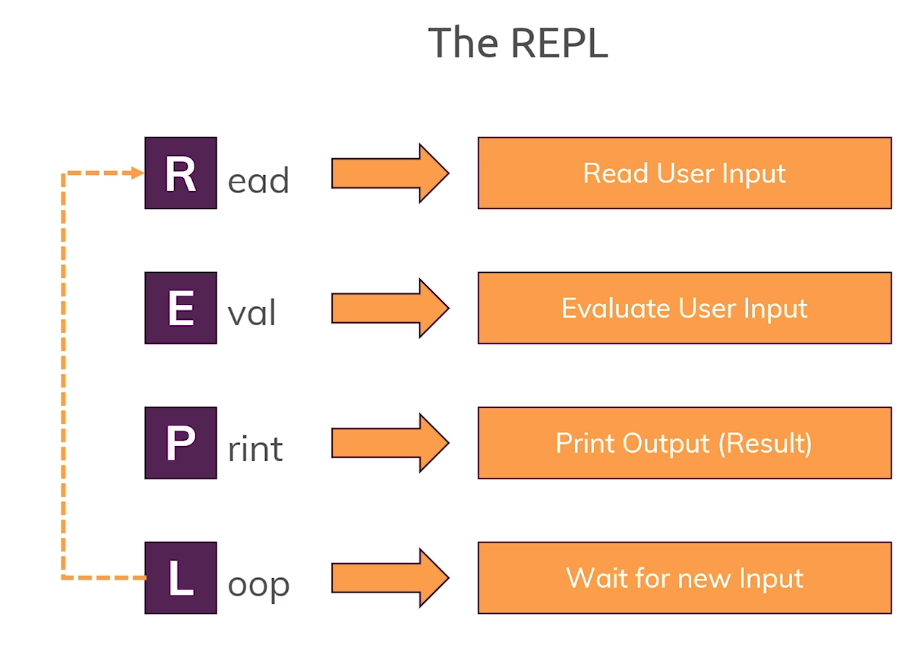

# nodeJS
## Udemy NodeJS - 'Complete' Guide
All images for learning purposes only, credit of ACADEMIND

If in violation of usage rules, send notice to fmiusov88@gmail.com

---

## Understanding Node in Context

## REPL 

This is the live terminal interface of NodeJS, similar to python's command line utility

___

## OOP Review

**Primitive Types** - string, number, boolean, undefined, null, symbol (ES6). *STORED IN STACK*, therefore more static in its value. New variables are stored at the top of the stack.

**Reference Values** - Object -> Array. *STORED IN HEAP*, therefore more dynamic in its value, easily modified. Stored randomly with each element having unique address. Pointers in the stack store the 'address' where that element is stored. The variable simply refers to the pointer's position in the stack, NOT the address of the element in the heap.

**In Summary** - to modify a reference value is to modify its pointer rather than the element in the heap. To modify a primitive is to modify the element itself.